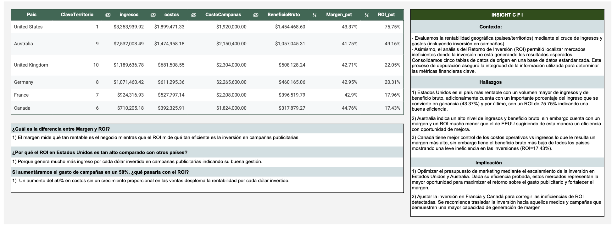

# 📊 Análisis del desempeño financiero de Adventure Works con SQL

## 📌 Descripción del proyecto

Este proyecto analiza el desempeño financiero de la empresa ficticia **Adventure Works** utilizando SQL.

El objetivo del análisis es identificar **qué mercados generan más ingresos y rentabilidad**, permitiendo al equipo financiero tomar decisiones sobre **dónde invertir el próximo presupuesto de marketing**.

Para ello se utilizan datos de ventas, productos, territorios y campañas de marketing para calcular indicadores financieros clave como **ingresos, costos, beneficio bruto, margen y retorno de inversión (ROI)**.

---

# 🎯 Objetivos del análisis

El proyecto busca responder dos preguntas principales de negocio:

1. **¿Cuánto estamos ganando por país?**
2. **¿Qué tan rentable es cada mercado considerando el gasto en marketing?**

Para responder estas preguntas se realizaron los siguientes pasos:

* Integración de múltiples tablas mediante **JOINs**
* Limpieza y preparación de datos
* Cálculo de **KPIs financieros**
* Validación de calidad de datos
* Análisis de rentabilidad por territorio

---

# 🗂 Dataset

El análisis utiliza un subconjunto del dataset **AdventureWorks**.

Tablas utilizadas:

| Tabla                | Descripción                              |
| -------------------- | ---------------------------------------- |
| ventas_2017          | Transacciones de ventas por producto     |
| productos            | Catálogo de productos con precio y costo |
| productos_categorias | Jerarquía de categorías                  |
| territorios          | Información geográfica                   |
| campanas             | Gasto de marketing por territorio        |

---

# ⚙️ Proceso de análisis

El análisis se realizó en tres etapas principales.

### 1️⃣ Limpieza y preparación de datos

Se integraron las tablas de ventas, productos y territorios para construir un dataset analítico que permite calcular ingresos y costos por pedido.

El proceso incluye:

* JOIN entre múltiples tablas
* manejo de valores nulos con `COALESCE`
* cálculo de ingresos y costos por línea de venta


---

### 2️⃣ Cálculo de KPIs financieros

Se calcularon métricas financieras clave como:

* ingresos totales
* costos totales
* beneficio bruto
* margen de beneficio
* retorno de inversión (ROI)

Estas métricas se analizaron por **territorio y país**.

---

### 3️⃣ Validación de calidad de datos

Para garantizar la calidad del análisis se implementaron verificaciones de datos:

* detección de valores nulos
* cantidades inválidas
* precios incorrectos

---

# 📈 KPIs analizados

El análisis se enfoca en las siguientes métricas:

* **Ingresos**
* **Costos**
* **Beneficio bruto**
* **Margen (%)**
* **ROI de marketing**

Estas métricas permiten comparar la rentabilidad entre mercados.

---

# 💡 Principales aplicaciones del análisis

Este tipo de análisis permite:

* identificar **mercados más rentables**
* optimizar la **inversión en marketing**
* detectar **ineficiencias en campañas**
* mejorar la **toma de decisiones financieras**

---

# 🛠 Tecnologías utilizadas

* **SQL**
* JOINS
* CTEs
* Agregaciones
* Cálculo de KPIs financieros
* Validación de calidad de datos

---

# 📁 Estructura del repositorio

```
sql/
  01_data_cleaning.sql
  02_kpi_analysis.sql
  03_data_validation.sql

reports/
  Dashboard-analisis_financiero_adventureworks.pdf
```

---

# 📚 Habilidades demostradas

Este proyecto demuestra habilidades clave para un **Data Analyst**:

* análisis financiero con SQL
* modelado de datos relacional
* limpieza y preparación de datos
* cálculo de métricas de negocio
* control de calidad de datos
* comunicación de insights

## 📊 Dashboard del análisis financiero

El dashboard resume los principales indicadores financieros de Adventure Works por territorio.

Incluye métricas como:

- Ingresos
- Costos
- Beneficio bruto
- Margen de rentabilidad
- ROI de marketing



### 📄 Versión en PDF

Puedes descargar el dashboard completo aquí:

[Descargar dashboard](dashboard_financiero_adventureworks.pdf)
